🌐 Live Demo: https://ai-health-assistant-mhorosvocxcrugg7k4n4ca.streamlit.app/

# 🩺 AI Health Assistant

An AI-powered healthcare web application built using Machine Learning and Artificial Intelligence.

This application predicts health conditions using trained Machine Learning models and also provides an AI-powered health assistant for educational purposes.

---

# 🚀 Features

✅ Heart Disease Prediction

✅ Diabetes Prediction

✅ AI Health Chat

✅ Interactive Dashboard

✅ PDF Health Report

✅ Clean User Interface

---
# 📸 Application Screenshots

## 🏠 Home Page

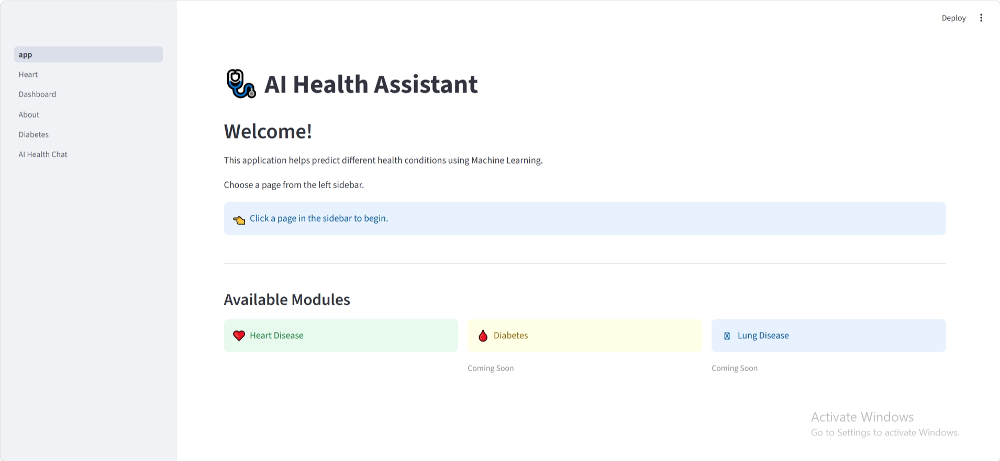

---

## ❤️ Heart Disease Prediction

### Patient Form (Part 1)

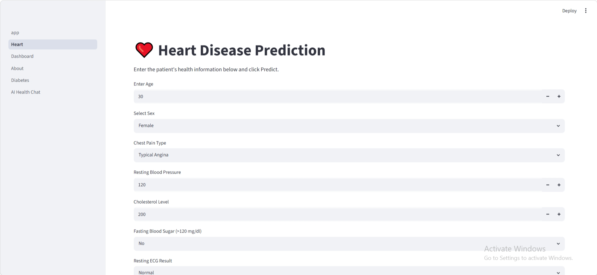

### Patient Form (Part 2)

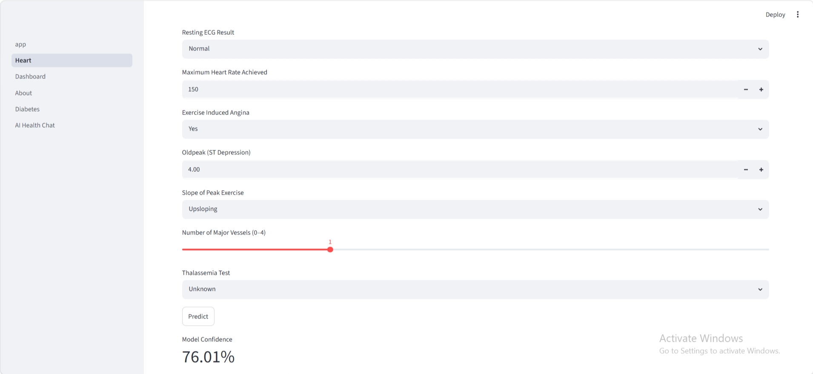

### Prediction Result

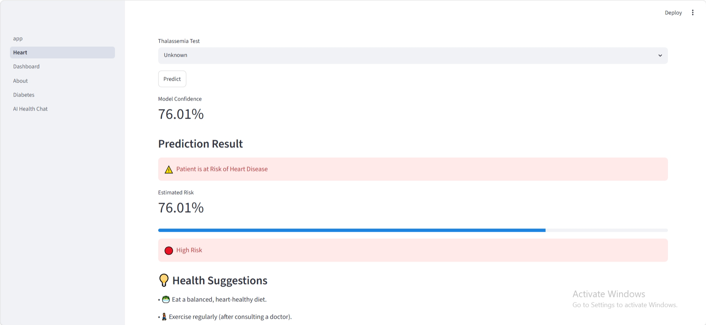

---

## 🩸 Diabetes Prediction

### Patient Form

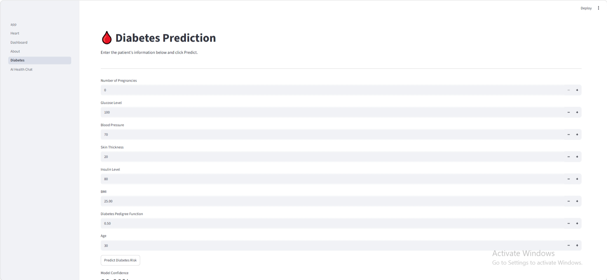

### Prediction Result

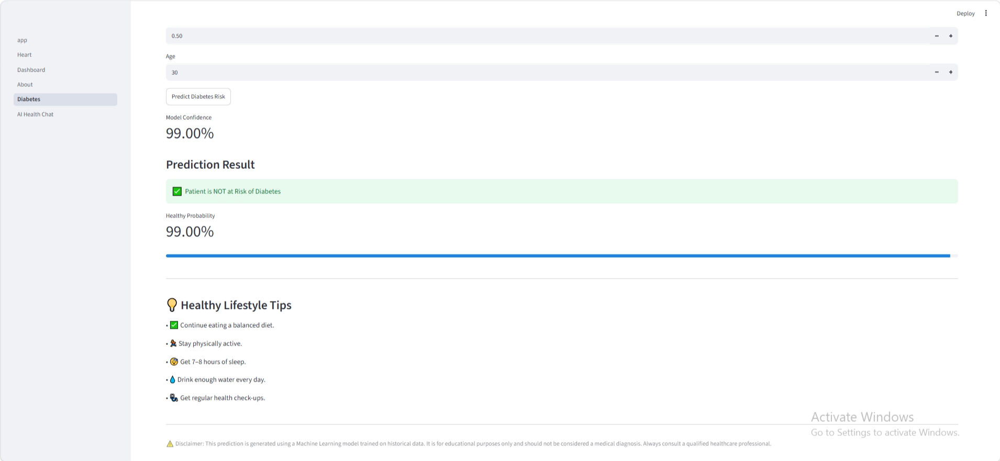

---

## 🤖 AI Health Chat

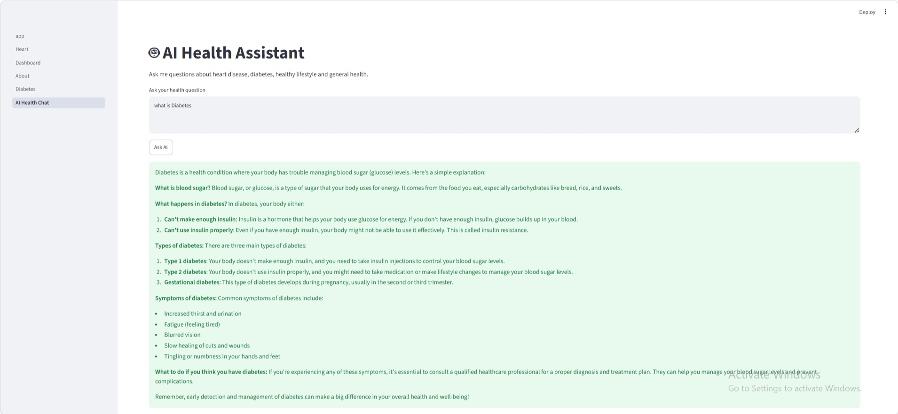

---

## 📊 Dashboard

### Disease Distribution

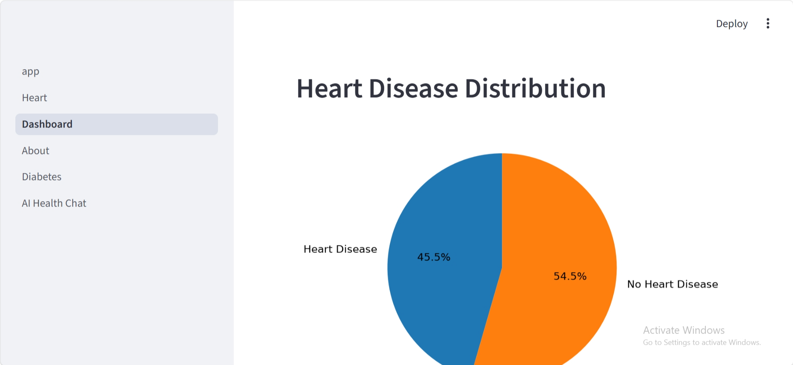

### Age Distribution

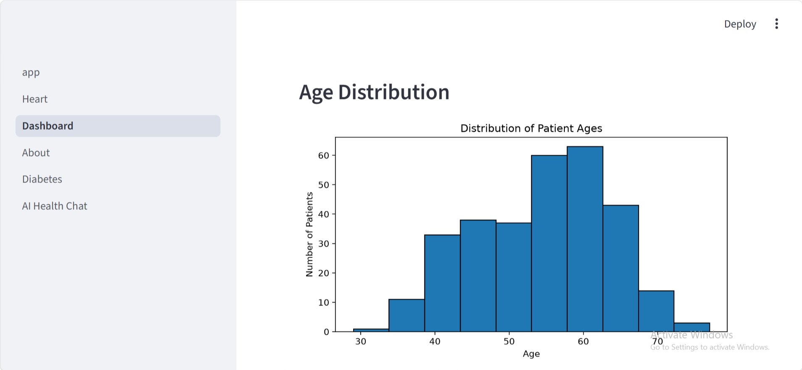

### Correlation Heatmap

### Feature Importance

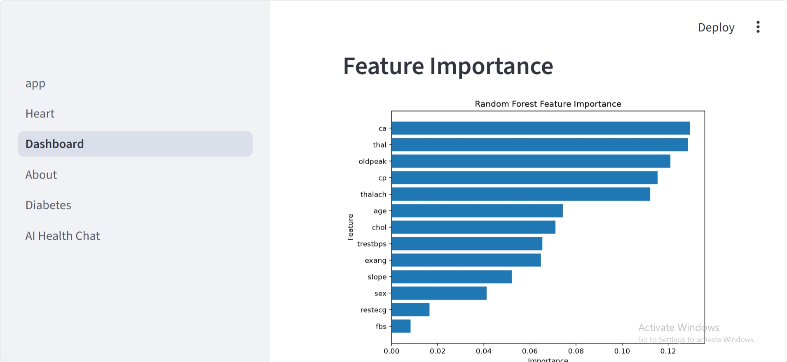

---

## ℹ️ About Page

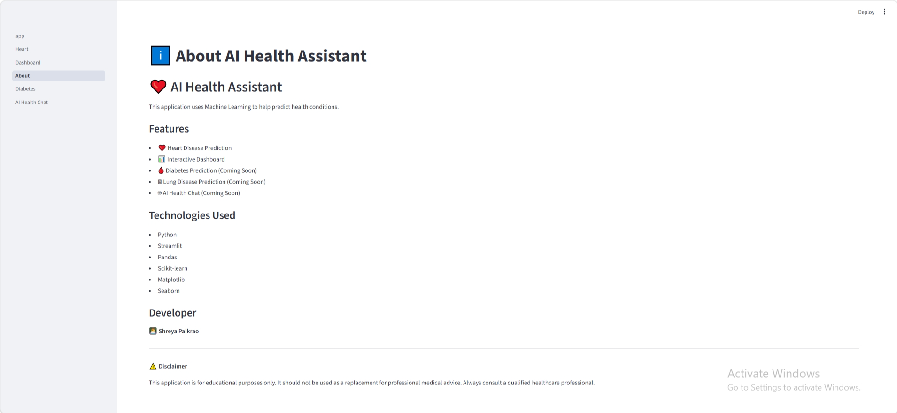
